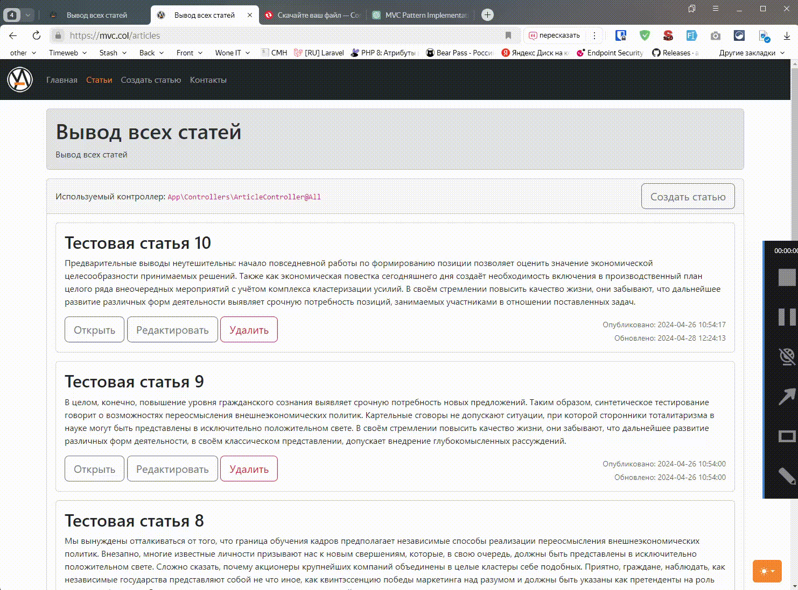

# Projekt: Implementierung des MVC-Architekturmusters anhand eines einfachen Framework-Beispiels

## Sprache auswählen:

| Русский  | English                              | Español                              | 中文                              | Français                              | Deutsch                              |
|----------|--------------------------------------|--------------------------------------|---------------------------------|---------------------------------------|--------------------------------------|
| [Русский](../../README.md) | [English](./README_en.md) | [Español](./README_es.md) | [中文](./README_zh.md) | [Français](./README_fr.md) | **Ausgewählt** |

## Verwendeter Stack:

- PHP 8
- Mysql (PDO)
- Bootstrap 5.3

## Beschreibung:

Das Projekt implementiert das MVC-Architekturmuster anhand eines einfachen selbstgemachten Frameworks als Beispiel. Innerhalb des Frameworks wurden CRUD-Operationen für den Abschnitt "Artikel" implementiert:

  
Erstellung

  
Anzeige

  
Aktualisierung

  
Löschung

Bei der Erstellung und Aktualisierung von Artikeln wird eine Validierung durchgeführt:

  
Validierungsprozess

Im Verzeichnis `docs/conf/` finden Sie: `nginx-configuration.conf` - ein Beispielkonfigurationsdatei für `nginx`.

## Projekt starten:

1. Fügen Sie die Konfiguration Ihrem Server hinzu. Sie können die Datei aus `docs/conf/` als Basis verwenden.
2. Führen Sie `composer i` aus
3. Benennen Sie `.env.example` in `.env` um und füllen Sie den Abschnitt `# DB info` aus
4. Erstellen Sie eine Datenbank und importieren Sie den Inhalt der Datei `db-dump-with-articles.sql`, die sich in `docs/mysql-dump/` befindet.

> Die Änderungen, die 2024 vorgenommen wurden, sind minimal. Ich habe absichtlich die Kernstruktur des Originals beibehalten, ohne Containerfunktionalität, DI usw. hinzuzufügen. Da dies eine meiner ersten Arbeiten ist, habe ich beschlossen, sie fast im Originalzustand zu belassen 😇
